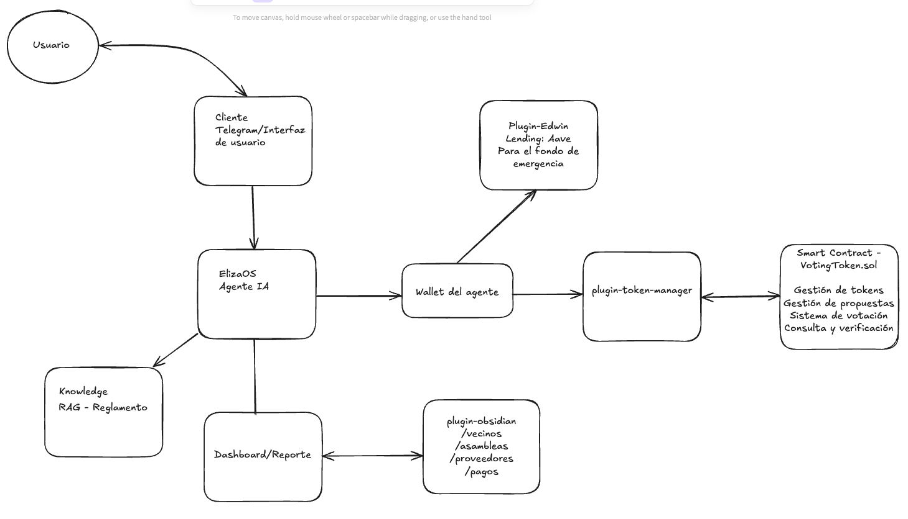

# Administración de Condominio con ElizaOS

<div align="center">
  
</div>

Este repo integra automatización, blockchain y gestión documental para la administración avanzada de condominios, usando agentes inteligentes (como Donna) y plugins personalizados.

---

## Plugins principales

### 1. [`@plugin-token-manager`](./packages/plugin-token-manager)

- **Propósito:** Gestiona wallets EVM, creación de actions para la interacción con contratos inteligentes.
- **Funcionalidad:**
  - Obtención de dirección y balance de la wallet del agente.
  - Cambio dinámico de red (chain).
  - Firma y envío de transacciones.
  - Integración con el contrato [VotingTokenNucleo](https://github.com/robz323/VotingTokenNucleo) para la gestión de propuestas y votaciones.

### 2. [`@plugin-obsidian`](./packages/plugin-obsidian)

- **Propósito:** Permite a los agentes de ElizaOS interactuar con un vault de Obsidian para almacenar, consultar y organizar información relevante del condominio.
- **Funcionalidad:**
  - Registro y consulta de vecinos, proveedores, asambleas y finanzas.
  - Acciones para agregar y listar vecinos (`ADD_VECINO`, `LIST_VECINOS`).
  - Lectura, escritura y búsqueda avanzada de archivos Markdown.
  - Integración con la API REST de Obsidian para operaciones automáticas desde el agente Donna.

---

## Contrato inteligente

### [VotingTokenNucleo](https://github.com/robz323/VotingTokenNucleo)

- **Propósito:** Proporciona la lógica de gobernanza y votación para el condominio.
- **Funcionalidad:**
  - Emisión y gestión de tokens de votación.
  - Creación, consulta y ejecución de propuestas.
  - Integración directa con el plugin `@plugin-token-manager` para automatizar flujos de votación desde Donna.

---

## Ejemplo de flujo de trabajo con el agente Donna

### 1. **Registro de vecinos**
**Mensaje al agente:**
```
Donna, agrega un vecino nuevo: Casa 22, Nombre: Mariana Gómez, Dirección: 0x9876543210abcdef9876543210abcdef98765432, Estado: Activo
```
**Resultado:**  
Donna registra el vecino en el archivo `Condominio/Vecinos/Registro de Vecinos.md` en Obsidian.

---

### 2. **Consulta de vecinos**
**Mensaje al agente:**
```
Donna, muestra la lista de vecinos
```
**Resultado:**  
Donna responde con una tabla Markdown con todos los vecinos registrados.

---

### 3. **Creación de propuesta de votación**
**Mensaje al agente:**
```
Donna, crea una propuesta para cambiar el proveedor de limpieza.
```
**Resultado:**  
Donna crea la propuesta en el contrato VotingTokenNucleo y la registra en Obsidian.

---

### 4. **Votación sobre una propuesta**
**Mensaje al agente:**
```
Vota a favor de la propuesta 3.
```
**Resultado:**  
Donna firma y envía la transacción de voto usando el plugin de token manager y actualiza el estado en Obsidian.

---

## Instalación y configuración

Sigue las instrucciones de cada plugin en sus respectivos README para la instalación y configuración de secrets (API keys, private keys, etc).

---

## Acciones destacadas

- `ADD_VECINO`: Agrega un vecino al registro en Obsidian.
- `LIST_VECINOS`: Lista todos los vecinos registrados en formato tabla Markdown.
- `SAVE_FILE`, `READ_FILE`, `SEARCH`, etc.: Operaciones generales sobre archivos en Obsidian.
- Acciones de votación y gestión de propuestas integradas con el contrato VotingTokenNucleo.

---

## Contribución

1. Haz fork del repositorio.
2. Crea una rama para tu feature o fix.
3. Haz commit y push de tus cambios.
4. Abre un Pull Request.

---

## Licencia

MIT